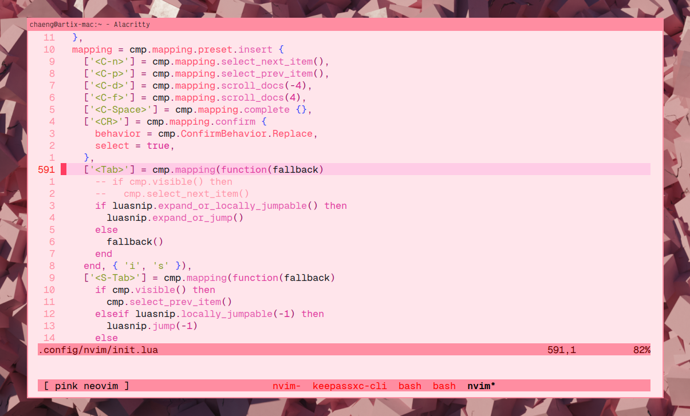

# Pinkish_Day

## Another pink theme to make the world better

## ** WARNING ** This is still in the early development



Try this colorscheme!

```lua
{
    'mustardfrog/pinkish_day'
    lazy = true,
    dependencies = { 'rktjmp/lush.nvim' },
}
```
